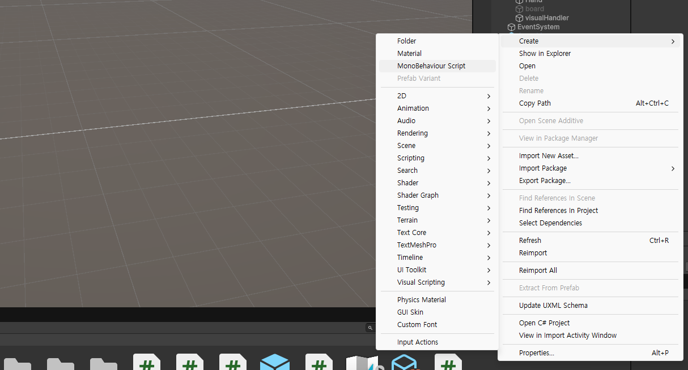
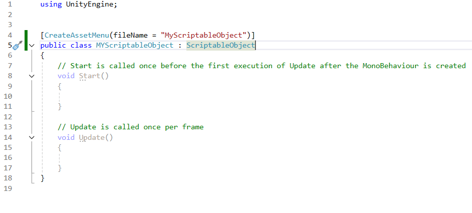

# scriptable object의 특징
## 데이터 컨테이너
 - 메모리 공간 절약, 에셋으로 저장됨
 - GameObject X, Transform X
 - 프로젝트 수준에서 데이터를 저장 가능
 - 여러 씬에서 동일한 데이터에 액세스 가능
## 모듈성
 - 데이터와 로직을 분리
 - 게임 통계, 아이템, NPC의 구성 값, 캐릭터 대화 등
## 관심사 분리
 - 게임플레이 데이터를 동작 로직에서 분리
 - 각 독립적인 부분 테스트 및 유지 관리 수월
 - 변경시 오류를 줄임
## Asset으로 저장
 - 게임 모드 외부에서도 유지
 - 런타임에 동적으로 변경되는 정적 구성을 로드 가능

# scriptable object의 작성 방법
1.C#스크립트 하나 생성

2.ScriptableObject에서 상속받도록 하고,
[CreateAssetmenu]기능을 사용하여 스크립터블 오브젝트를 에셋메뉴에서 만들도록 함

