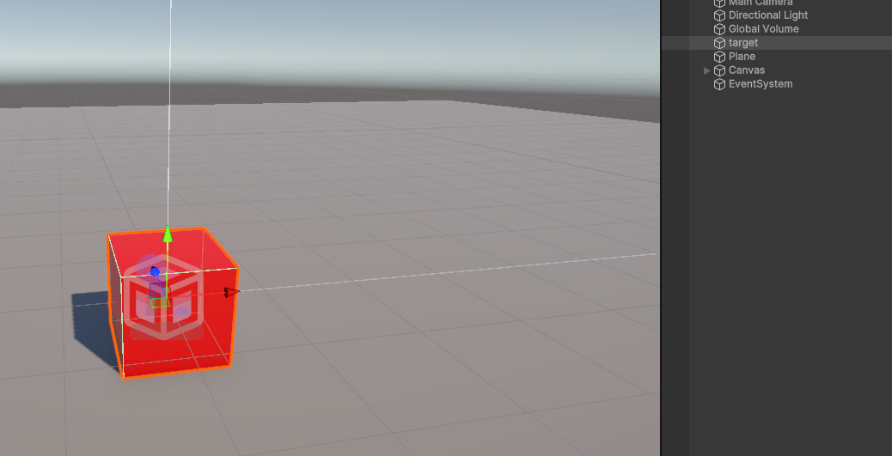
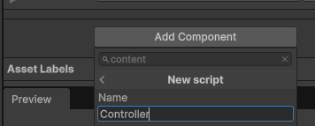
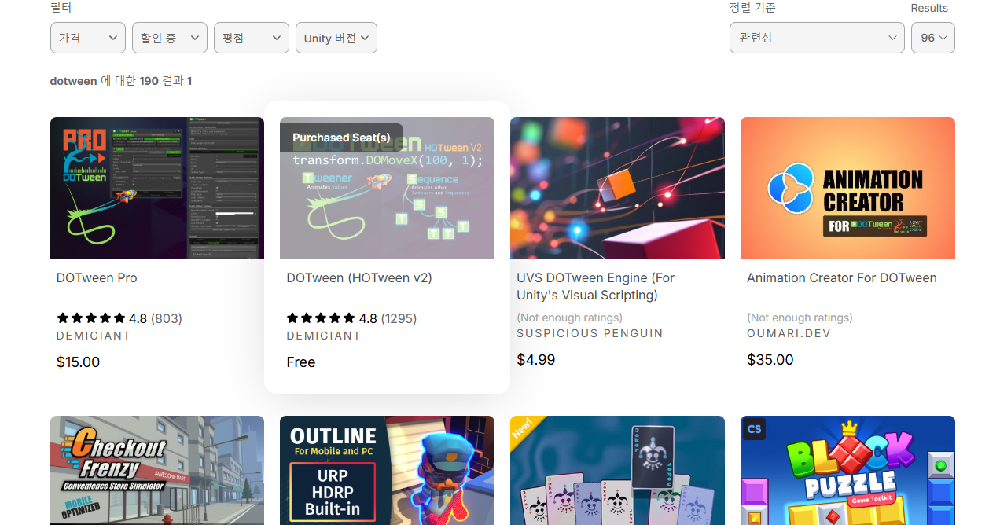
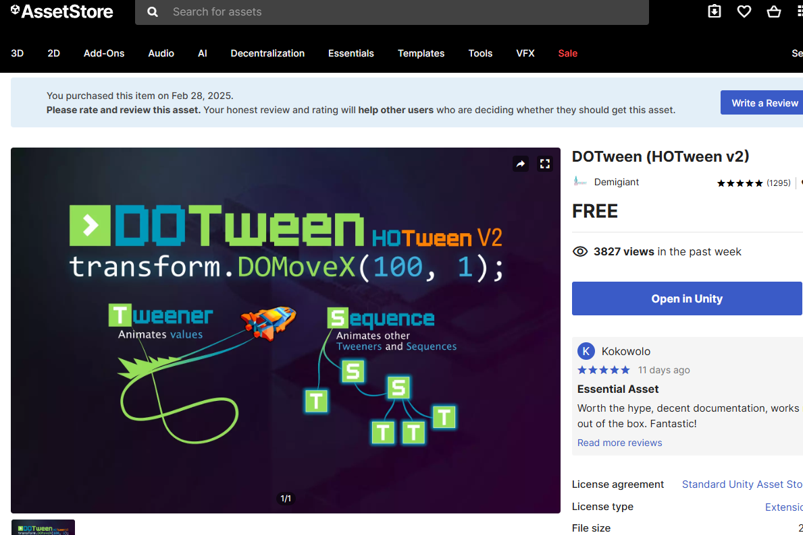
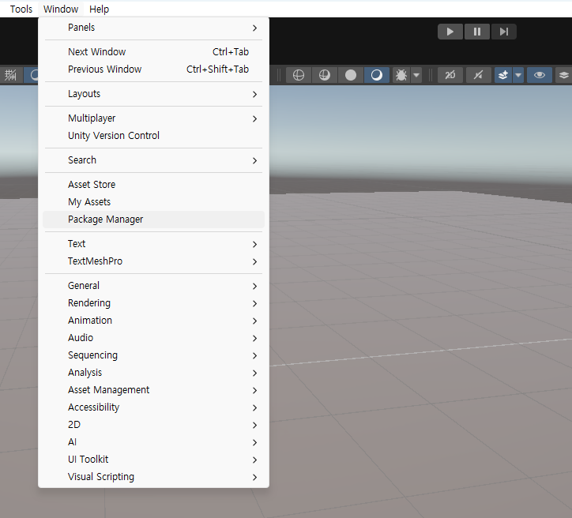
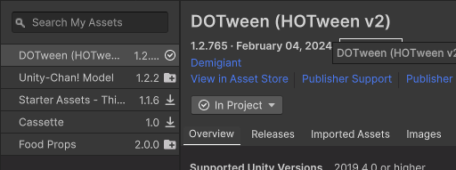

# 오브젝트 마우스로 드래그
## 1. 일단 게임오브젝트를 생성한다.


## 2. 새로운 스크립트 컴포넌트를 추가한다.


## 3. 스크립트를 작성하기 전에 dotween 플러그인을 설치한다.
  __- 에셋스토어에서 dotween을 검색한다.__
    
  __- DOTween (HOTween v2)을 클릭한다.__
    
  __- 설치한다.__
    
  __- 유니티를 열고 Window탭의 Package Manager클릭__
    
  __- DOTween 패키지를 import하면 끝!__
    
    
## 4. 스크립트를 다음과 같이 작성한다.

```
using System.Runtime.InteropServices;
using UnityEngine;
using UnityEngine.Events;
using UnityEngine.EventSystems;
using DG.Tweening;

public class controller : MonoBehaviour
{
    Vector3 mousePosition; //
    private GameObject target;
    private bool isSelected;
    private Vector3 GetMousepos()
    {
        return [Camera.main.WorldToScreenPoint(transform.position)](# 1.WorldToScreenPoint);
        //이 트랜스폼 좌표를 스크린의 좌표로 변환한다.
    }

    private void OnMouseDown()
    {
        mousePosition = Input.mousePosition - GetMousepos();
    }

    private void OnMouseDrag()
    {
        isSelected = true;

        transform.DOMove(Camera.main.ScreenToWorldPoint(Input.mousePosition - mousePosition),0.5f);
        Debug.Log($"{GetMousepos()} / {Input.mousePosition} / {mousePosition} /// {transform.position}");
    }

    private void OnMouseUp()
    {
        
        isSelected = false;
    }


    private void Update()
    {
        //선택되지 않으면 원래자리로 돌아감
        
        if (!isSelected) transform.DOMove(Vector3.zero, 0.1f);
    }
}
```

# 문법 설명
## 1.WorldToScreenPoint
