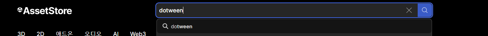

# 오브젝트 마우스로 드래그
## 1. 일단 게임오브젝트를 생성한다.


## 2. 새로운 스크립트 컴포넌트를 추가한다.


## 3. 스크립트를 작성하기 전에 dotween 플러그인을 설치한다.
  __- 에셋스토어에서 dotween을 검색한다.__
    
  __- DOTween (HOTween v2)을 클릭한다.__
    
  __- 설치한다.__
    
  __- 유니티를 열고 Window탭의 Package Manager클릭__
    
  __- DOTween 패키지를 import하면 끝!__
    
    
## 4. 스크립트를 다음과 같이 작성한다.

```
using System.Runtime.InteropServices;
using UnityEngine;
using UnityEngine.Events;
using UnityEngine.EventSystems;
using DG.Tweening;

public class controller : MonoBehaviour
{
    private Vector3 mousePosition; //마우스의 위치를 저장하는 변수
    private bool isSelected;//이 오브젝트가 선택되었는지 판별해주는 변수

    private Vector3 GetMousepos()
    {
        return Camera.main.WorldToScreenPoint(transform.position)
        //이 트랜스폼 좌표를 스크린의 좌표로 변환한다.
        /*WorldToScreenPoint()
          월드공간의 position을 화면공간으로 바꿔준다.
          좌측하단의 픽셀은(0,0)이고, 우측상단의 픽셀은(픽셀기준 화면너비 - 1,픽셀기준 화면높이 - 1) 이다.
          반환값의 z축은 카메라부터(카메라 Lookat 기준) 매개변수의 포지션까지의 거리이다.
        */
    }

    private void OnMouseDown()//마우스가 이 오브젝트를 눌렀을 때 실행
    {
        mousePosition = Input.mousePosition - GetMousepos();
    }

    private void OnMouseDrag()//드래그를 실행할때 실행
    {
        isSelected = true;//드래그 할때 이 오브젝트는 선택됨
        transform.DOMove(Camera.main.ScreenToWorldPoint(Input.mousePosition - mousePosition),0.5f);
        Debug.Log($"{GetMousepos()} / {Input.mousePosition} / {mousePosition} /// {transform.position}");
    }

    private void OnMouseUp()//이 오브젝트에서 마우스를 띄었을때 실행
    {
        isSelected = false;//마우스를 이 오브젝트에서 뗏을때 선택 해제
    }


    private void Update()
    {
        //선택되지 않으면 원래자리로 돌아감
        if (!isSelected) transform.DOMove(Vector3.zero, 0.1f);
    }
}
```
